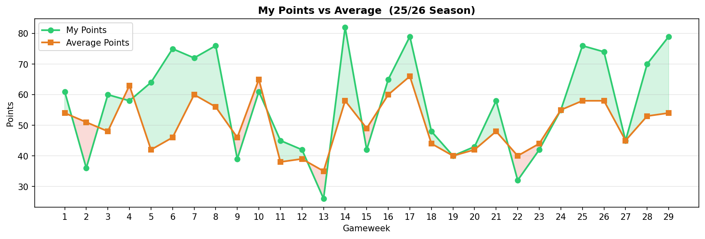

# FPL2025 - Autonomous Fantasy Premier League Bot

An autonomous FPL bot that manages transfers, selects lineups, and picks captains using ML predictions and multi-metric optimization. Deployed on GCP (Cloud Run, Cloud Scheduler, Artifact Registry) via Terraform.

## How It Works
1. **Data Collection** - Fetches live player stats, fixtures, and form from the FPL API
2. **ML Prediction** - An Extra Trees model predicts player ROI for the upcoming gameweek
3. **Team Analysis** - Z-score normalization ranks each player across multiple metrics, with position-specific weights applied via Simple Additive Weighting (SAW) to produce a single composite score
4. **Transfer Execution** - Identifies the weakest players, finds valid replacements that improve the composite score, and optionally executes transfers automatically

## Evaluation Methods
- **Z-Score Normalization** - Each metric (points, goals, assists, minutes, ROI, PPG) is standardized relative to the squad mean/std, making cross-metric comparison possible
- **Simple Additive Weighting (SAW)** - Position-specific weights are applied to z-scores and summed into a single value, so a midfielder is judged differently from a goalkeeper

## Model Performance (25/26 Season - 29 GWs)



| Metric | Value |
|---|---|
| Total Points | 1609 |
| Cumulative Points Above Average | +152 |
| Gameweeks Beat or Matched Average | 21 / 29 (72%) |
| Best Gameweek | GW14: 82 pts (avg 58) |
| Worst Gameweek | GW13: 26 pts (avg 35) |

Raw data: [`performance_weekly_performance.csv`](performance_weekly_performance.csv)

## Stack
Python 3.11 | PyCaret | aiohttp | Pandas | GCP (Cloud Run, Terraform) | Docker

## Setup
Requires a valid FPL account. Credentials are managed via environment variables - never commit them.
```
pip install -r requirements.txt
```

## Acknowledgments
FPL API, @vaastav, @amosbastian, and the FPL community.
